# HealthSync — Healthcare Management System

HealthSync is an all-in-one healthcare platform that connects patients, doctors, and administrators under a single system — combining online medicine ordering, doctor appointments, prescription management, emergency ambulance dispatch, and AI-powered health guidance.

Built with a **React.js** frontend and a **Django REST Framework** backend, HealthSync integrates a machine-learning symptom checker and an LLM-powered RAG chatbot to deliver personalized care recommendations from the comfort of home.

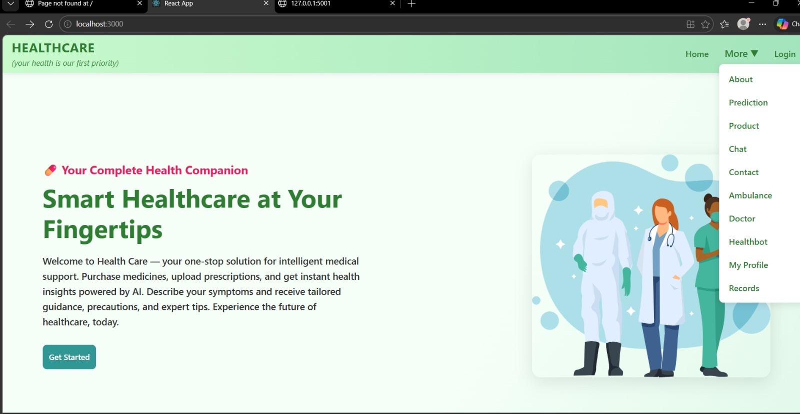

---

## Table of Contents

- [Features](#features)
- [Tech Stack](#tech-stack)
- [Screenshots](#screenshots)
- [Project Structure](#project-structure)
- [Getting Started](#getting-started)
- [Collaborators](#collaborators)

---

## Features

### For Patients

- **Account & Role-based Auth** — separate sign-in flows for patients, doctors, and admins, with JWT authentication and password reset.
- **AI Disease Prediction** — enter symptoms to get a predicted condition along with medication, diet, precaution, and workout suggestions, downloadable as a PDF prescription.
- **Healthbot (AI Assistant)** — an LLM + RAG powered chatbot that answers medical questions using a curated knowledge base, available 24/7.
- **Doctor Directory & Appointments** — browse doctors by specialty, qualification, and fee, then book and track appointment status.
- **Video Consultations** — in-browser doctor video calls powered by Jitsi.
- **Online Pharmacy** — browse and purchase medicines with secure **Stripe** checkout.
- **Prescription Upload** — upload prescription images and track them against your profile.
- **Ambulance Booking** — request an ambulance by type, pickup/destination, and schedule, for emergency or planned transport.
- **Contact & Voice Input** — reach support via a contact form with speech-to-text input.
- **Medical Records** — view and manage personal health records in one place.

### For Doctors

- Dedicated doctor login and profile management.
- View and manage assigned appointments.

### For Admins

- **Doctor Management** — add, edit, and remove doctor profiles and credentials.
- **Product Management** — manage the medicine catalog (name, description, price, image).
- **Ambulance Management** — manage ambulance types and contact numbers.
- **Transactions** — view Stripe payment history per user.
- **Prescriptions & Contact Messages** — review uploaded prescriptions and incoming messages, automatically classified by sentiment (Good / Bad / Other).

---

## Tech Stack

| Layer | Technology |
|---|---|
| Frontend | React 18, React Router, Bootstrap, Tailwind CSS, Axios, Lottie |
| Backend | Django 6, Django REST Framework, SimpleJWT, django-cors-headers |
| Payments | Stripe |
| Video Calls | Jitsi (`@jitsi/react-sdk`) |
| Voice Input | `react-speech-recognition` |
| Disease Prediction | Python / scikit-learn (Jupyter notebook + trained model) |
| AI Chatbot | Flask, LangChain, Google Gemini, Pinecone (RAG pipeline) |
| Scheduled Jobs | django-apscheduler, django-crontab |
| Database | SQLite (development) |

---

## Screenshots

<table>
<tr>
<td width="50%">

**Sign In**
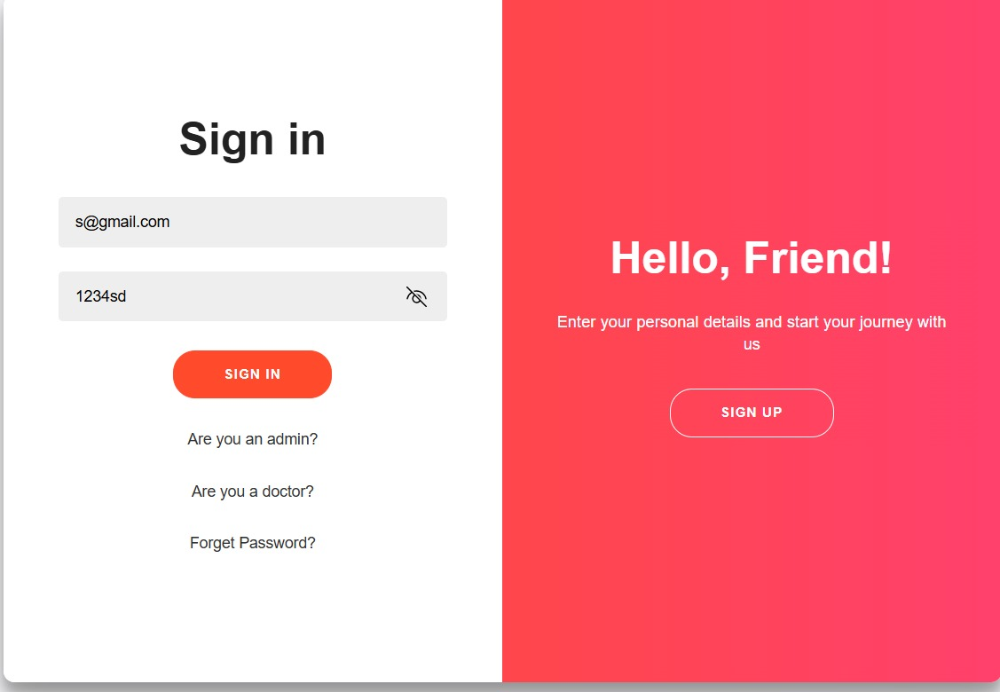

</td>
<td width="50%">

**About**
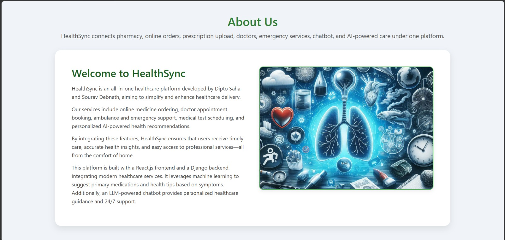

</td>
</tr>
<tr>
<td width="50%">

**AI Disease Prediction**
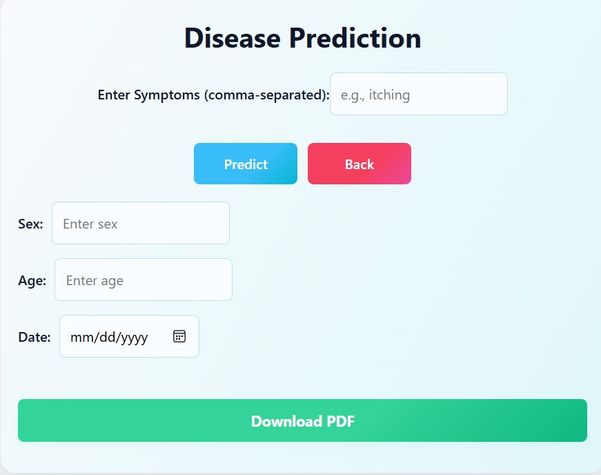

</td>
<td width="50%">

**AI-Generated Prescription**
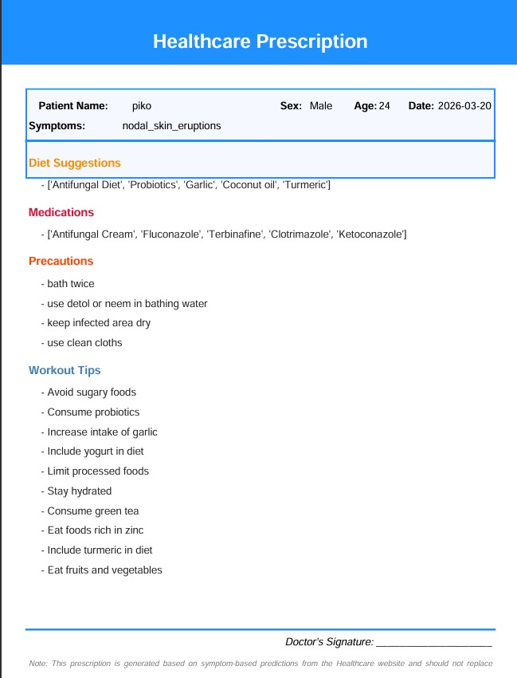

</td>
</tr>
<tr>
<td width="50%">

**Healthbot (RAG Chat Assistant)**
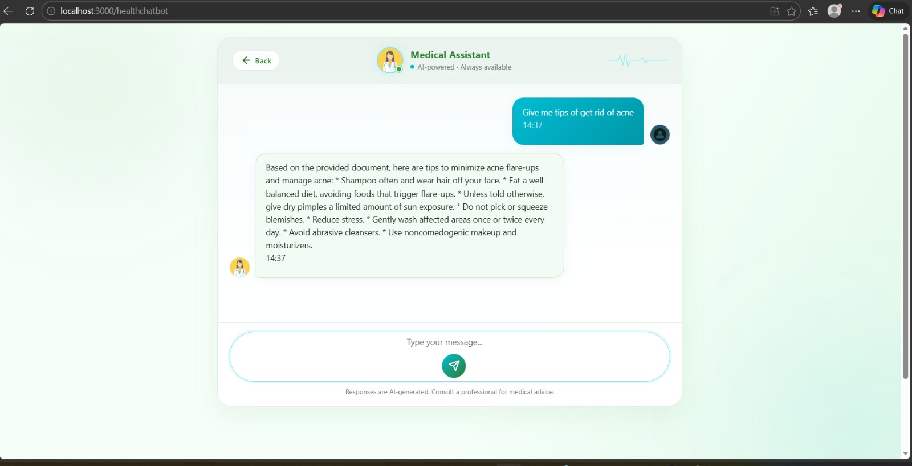

</td>
<td width="50%">

**Appointments**
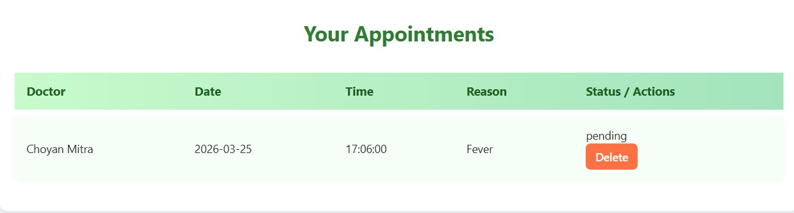

</td>
</tr>
<tr>
<td width="50%">

**Ambulance Service (Patient)**
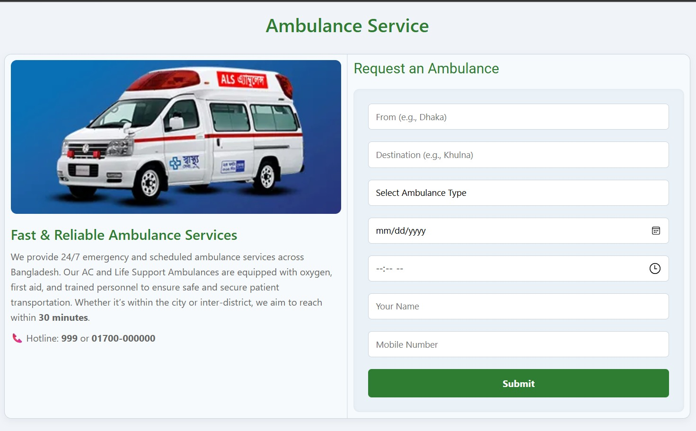

</td>
<td width="50%">

**Ambulance Management (Admin)**
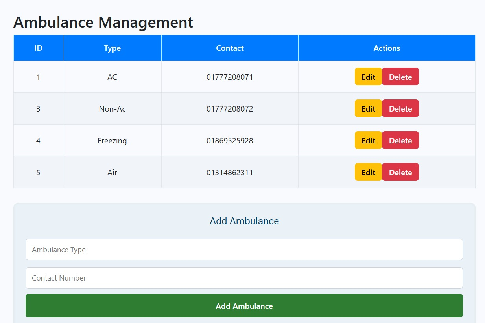

</td>
</tr>
<tr>
<td width="50%">

**Contact Form with Voice Input**
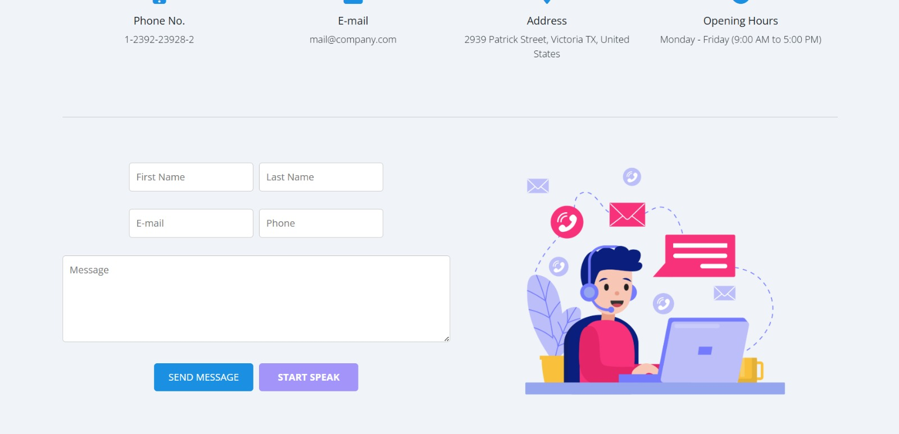

</td>
<td width="50%">

**Contact Messages (Admin, Sentiment-Tagged)**
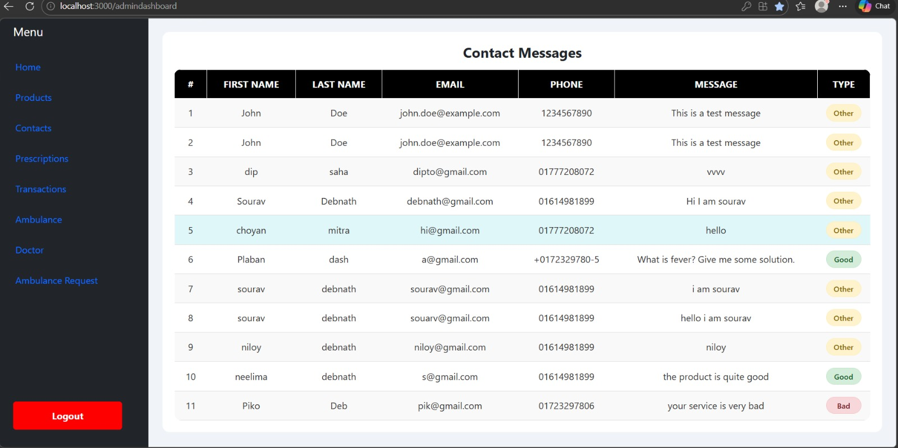

</td>
</tr>
<tr>
<td width="50%">

**Doctor Management (Admin)**
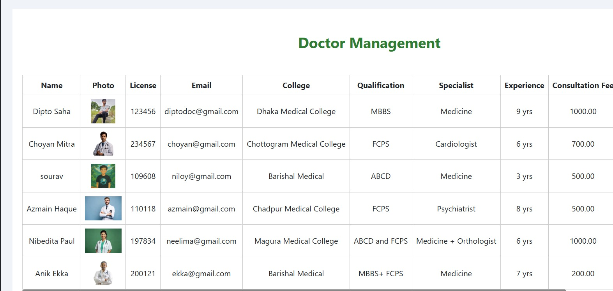

</td>
<td width="50%">

**Product Management (Admin)**
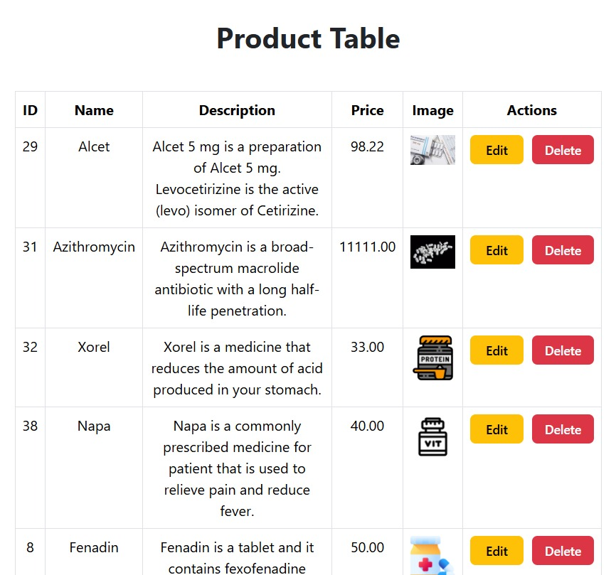

</td>
</tr>
<tr>
<td width="50%">

**Prescriptions (Admin)**
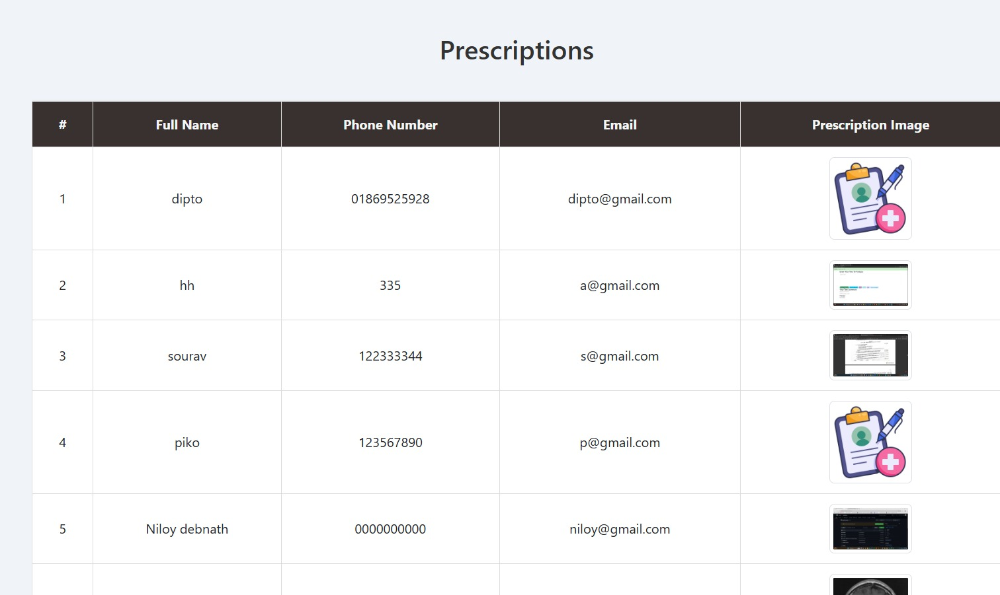

</td>
<td width="50%">

**Transactions (Admin)**
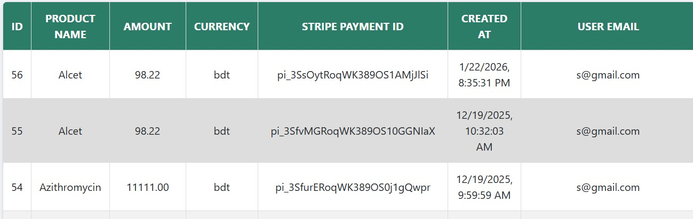

</td>
</tr>
</table>

---

## Project Structure

```text
HealthCareSystem/
├── healthcare/
│   ├── Backend/               # Django REST API
│   │   ├── accounts/          # Patient accounts
│   │   ├── doctor/            # Doctor profiles & directory
│   │   ├── doctor_auth/       # Doctor authentication
│   │   ├── Appointment/       # Appointment booking
│   │   ├── ambulance/         # Ambulance catalog
│   │   ├── ambulanceRequest/  # Ambulance booking requests
│   │   ├── payments/          # Stripe integration
│   │   ├── transactions/      # Payment history
│   │   ├── records/           # Medical records, PDF generation, scheduled tasks
│   │   ├── contact/           # Contact messages + sentiment classification
│   │   ├── Disease_recg/      # ML model, notebook & symptom-based prediction
│   │   └── backend/           # Django project settings
│   ├── Frontend/              # React application
│   │   └── src/Components/    # Feature components (Doctor, Ambulance, Chat, Payment, ...)
│   └── medical_chatbot/
│       └── healthcare-rag-assistant/  # Flask + LangChain + Gemini + Pinecone RAG chatbot
```

---

## Getting Started

### Prerequisites

- Node.js & npm
- Python 3.12+
- pip

### Backend Setup

```bash
cd healthcare/Backend
python -m venv venv
venv\Scripts\activate        # Windows
pip install -r ../requirements.txt
# Configure environment variables (DB, Stripe keys, JWT secrets, etc.) in a .env file
python manage.py migrate
python manage.py runserver
```

### Frontend Setup

```bash
cd healthcare/Frontend
npm install
npm start
```

### AI Chatbot Service (optional)

```bash
cd healthcare/medical_chatbot/healthcare-rag-assistant
python -m venv myenv
myenv\Scripts\activate        # Windows
pip install -r requirements.txt
# Configure GOOGLE_API_KEY and PINECONE_API_KEY in a .env file
python app.py
```

---

## Collaborators

- [Sourav Debnath](https://github.com/souravdebnath109)
- Dipto Saha
